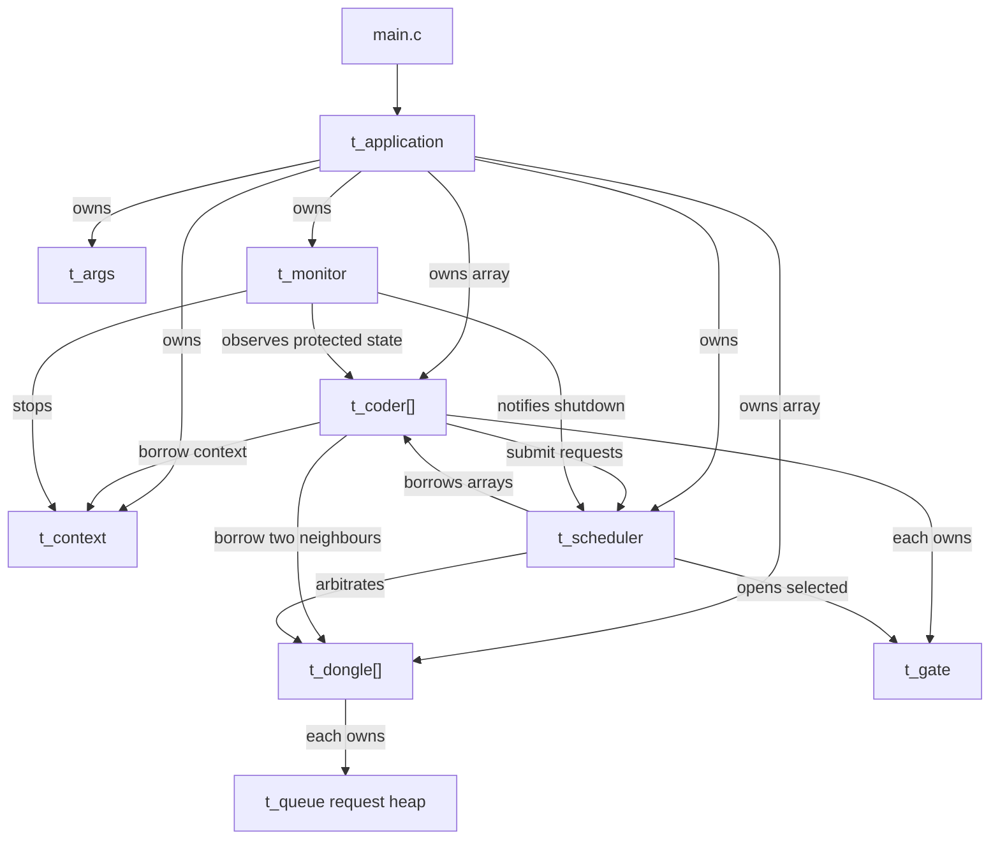
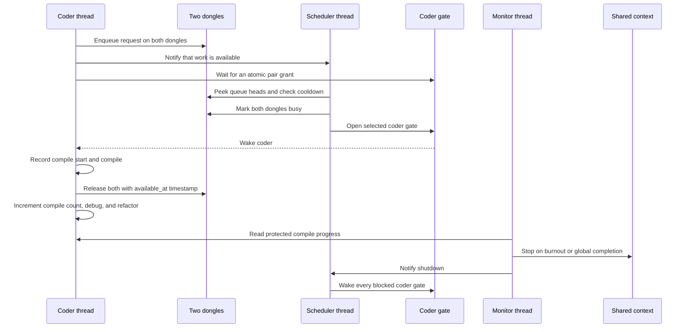

*This project has been created as part of the 42 curriculum by vlnikola.*

# Codexion

## Description

Codexion is a concurrency simulation inspired by the Dining Philosophers
problem. Coders sit around a shared workspace and repeatedly compile, debug,
and refactor. A coder needs both adjacent USB dongles at the same time to
compile, but every dongle is shared with a neighbour and remains unavailable
for a cooldown period after use.

The goal is to coordinate the coder threads without data races, deadlocks, or
unfair resource access. A dedicated scheduler grants dongles using either FIFO
(first request first) or EDF (earliest burnout deadline first). A separate
monitor stops the simulation when a coder burns out or when every coder reaches
the required number of compiles.

## Table of Contents

- [Description](#description)
- [Development History](#development-history)
- [Current Status](#current-status)
- [Codebase Structure](#codebase-structure)
- [Architecture and Wiring](#architecture-and-wiring)
- [Runtime Flow](#runtime-flow)
- [Application Lifecycle](#application-lifecycle)
- [Blocking Cases Handled](#blocking-cases-handled)
- [Thread Synchronization Mechanisms](#thread-synchronization-mechanisms)
- [Instructions](#instructions)
- [Resources](#resources)
- [AI Usage Disclosure](#ai-usage-disclosure)

## Development History

I developed the project incrementally so that ownership and cleanup were clear
before starting the thread routines:

1. I implemented the argument parser and validation for all mandatory values,
   including the `fifo` and `edf` scheduler modes.
2. I introduced `t_application` as the composition root. It owns every
   allocation and initialized synchronization object, which gives the program
   one place for failure rollback and final cleanup.
3. I separated data definitions into `include/structs/`, public module
   interfaces into `include/modules/`, and implementations into matching
   folders under `src/`.
4. I implemented the custom binary heap used by dongle request queues. FIFO
   compares arrival sequence; EDF compares burnout deadline and then uses
   deterministic tie-breakers.
5. I added the shared context, protected running state, time helpers, and
   condition-variable-based coder gates.
6. I implemented initialization and partial-failure cleanup for dongles,
   coders, the scheduler, and the monitor.
7. I wired application initialization in dependency order and cleanup in
   reverse order. This has been checked with a complete build and Valgrind.
8. I added thread-safe dongle requests and releases, protected coder-state
   access, serialized logging, and scheduler notifications.
9. I implemented atomic two-dongle requests, queue-head arbitration, stable
   dongle lock ordering, pair grants, and timed scheduler waits for cooldowns.
10. I implemented the coder cycle: request, wait, compile, release, debug, and
    refactor, including interruption and failure paths.
11. I implemented monitor polling for burnout and global completion. A monitor
    stop notifies the scheduler, which wakes every coder gate during shutdown.
12. I completed application runtime orchestration: one shared start timestamp,
    tracked thread creation, partial-startup rollback, and joining every thread
    that was successfully created.

## Current Status

Completed:

- [x] Argument parsing and scheduler-mode validation.
- [x] Application ownership model and module interfaces.
- [x] FIFO/EDF request heaps with deterministic tie-breakers.
- [x] Shared context, time helpers, coder gates, and serialized logging.
- [x] Dongle, coder, scheduler, and monitor initialization and cleanup.
- [x] Thread-safe dongle request and release operations.
- [x] Atomic pair scheduling and cooldown-aware timed waiting.
- [x] Interruptible coder compile/debug/refactor cycles.
- [x] Burnout and all-coders-finished monitoring.
- [x] Scheduler-driven wakeup of blocked coder gates during shutdown.
- [x] One shared runtime start timestamp in the context and every coder.
- [x] Safe scheduler, coder, and monitor thread creation.
- [x] Stop, wake, and join rollback after partial thread-creation failure.
- [x] Joining every successfully created thread before resource cleanup.
- [x] End-to-end FIFO, EDF, cooldown, burnout, completion, and one-coder
      checks.
- [x] Final Memcheck, DRD, relink, and burnout-timing verification.

## Codebase Structure

```text
.
├── Makefile
├── README.md
├── include
│   ├── structs              Data and ownership definitions only
│   │   ├── application.h
│   │   ├── args.h
│   │   ├── coder.h
│   │   ├── context.h
│   │   ├── dongle.h
│   │   ├── gate.h
│   │   ├── monitor.h
│   │   ├── queue.h
│   │   ├── request.h
│   │   └── scheduler.h
│   └── modules              Behaviour interfaces used by callers
│       ├── application_api.h
│       ├── coder_api.h
│       ├── context_api.h
│       ├── dongle_api.h
│       ├── gate_api.h
│       ├── logger_api.h
│       ├── monitor_api.h
│       ├── parser_api.h
│       ├── queue_api.h
│       ├── scheduler_api.h
│       └── time_api.h
└── src
    ├── application          Composition, startup, shutdown, and cleanup
    ├── coder                Per-coder state and thread routine
    ├── context              Shared simulation state
    ├── dongle               Dongle state, requests, and cooldown
    ├── gate                 Per-coder condition-variable event
    ├── monitor              Burnout and completion detection
    ├── parser               Argument parsing and validation
    ├── queue                Private FIFO/EDF binary heap
    ├── scheduler            Arbitration and atomic pair grants
    ├── utils                Time and serialized logging helpers
    └── main.c               Application entry point
```

Headers are not compiled or added to `SRC` in the Makefile. Source files
include the headers they need. The private `src/queue/queue_internal.h` and
`src/scheduler/scheduler_internal.h` headers belong to their implementations
and are not exposed as public interfaces.

Type and naming conventions:

- `bool` stores predicates and initialization flags;
- `size_t` stores array sizes, capacities, and zero-based array positions;
- `int` stores parsed values, compile counts, and externally displayed coder
  IDs;
- `index` consistently names an array position, while `coder_id` names the
  one-based value printed in logs;
- `const` is used for borrowed input that a function only reads, but not for an
  object whose mutex must be locked or whose state may change.

## Architecture and Wiring

`t_application` is the only object that sees and owns the complete program.
Lower modules receive only the references required for their work. In
particular, coders cannot inspect other coders, and dongles do not hold coder
pointers.



Important access rules:

- A coder knows its own state, its left and right dongles, its gate, the shared
  context, and the scheduler used to submit work. It has no pointer to the
  coder array.
- A dongle owns its availability state, mutex, and request heap. It does not
  know which coder objects exist.
- A request stores a coder ID, deadline, and arrival sequence rather than a
  coder pointer.
- The scheduler is the only runtime module allowed to inspect all coders and
  dongles when deciding a grant.
- The monitor reads coder progress through the coder data interface, stops the
  simulation through the context interface, and notifies the scheduler so
  blocked threads can leave their waits.

## Runtime Flow

The application runner creates the scheduler, coder, and monitor threads, and
the runtime follows this sequence:



A request is copied into both required dongle heaps while the scheduler mutex
is held. The request itself is only a scheduling ticket: after both queue roots
select that coder, the scheduler removes both copies, marks both dongles busy,
and opens the coder's gate. No request object needs separate cleanup.

When no pair can be granted, the scheduler sleeps on its condition variable.
If queued work is blocked only by cooldown, it uses the earliest relevant
`available_at` value as an absolute `pthread_cond_timedwait()` deadline. New
requests, releases, and shutdown still wake it immediately through a signal.

For EDF, a request deadline is:

```text
last_compile_start + time_to_burnout
```

For FIFO, arrival sequence decides priority. Equal-priority requests use stable
tie-breakers so the same input produces the same ordering.

## Application Lifecycle

Initialization follows dependency order:

```text
parse arguments
    -> initialize context
    -> allocate and initialize dongles and queues
    -> allocate and initialize coders and gates
    -> initialize scheduler
    -> initialize monitor
```

Each module cleans its own partially initialized object. If a later stage
fails, `init_application()` calls `free_application()`, which destroys only the
resources recorded as successfully initialized.

The implemented runtime lifecycle is:

```text
initialize
    -> lock the startup barrier
    -> create scheduler, coder, and monitor threads behind the barrier
    -> set one shared start time
    -> release all threads by unlocking the barrier
    -> run until burnout, completion, or startup failure
    -> mark the context as stopped
    -> broadcast or open every blocking wait point
    -> join every successfully created thread
    -> destroy synchronization objects and allocations
```

Final cleanup runs in reverse dependency order:

```text
scheduler -> coders -> dongles -> context
```

Threads must be stopped and joined before their mutexes and condition variables
are destroyed.

## Blocking Cases Handled

### Deadlock prevention

Coders request two dongles as one logical operation instead of taking one and
waiting while holding it. The scheduler locks dongles in stable ID order and
grants both together. This removes the hold-and-wait condition and prevents
circular lock acquisition.

### Starvation prevention

Every dongle uses a heap ordered by the selected policy. FIFO preserves arrival
order. EDF prioritizes the coder with the earliest burnout deadline. Arrival
sequence and coder ID provide deterministic tie-breakers. A grant is valid only
when the coder is eligible at the head of both required dongle queues.

### Dongle cooldown

A released dongle records `available_at = release_time + dongle_cooldown`. The
scheduler does not grant it before that timestamp, even if its request queue is
not empty. It uses a timed condition wait until the earliest useful cooldown
deadline instead of holding a mutex or polling continuously.

### Precise burnout detection

The monitor runs independently from coder threads. It reads each coder's
`last_compile_start` under the coder data mutex and compares the deadline with
the current time. It polls every 500 microseconds so burnout can be reported
within the required 10 ms window under normal scheduling conditions.

### Log serialization

All state messages pass through one logger protected by `context->log_mutex`.
This prevents output from different threads from interleaving. After the
context is stopped, normal state messages must be suppressed so nothing is
printed after the burnout message.

### Safe shutdown

Stopping changes `context->is_running` under `state_mutex`. The monitor then
notifies the scheduler, and the scheduler opens every coder gate before it
exits. After a startup failure, `run_application()` applies the same
stop-and-notify sequence and joins every created thread before cleanup.

### One-coder case

With one coder, the left and right pointers refer to the same single dongle.
The coder cannot obtain two distinct dongles and must eventually burn out. The
implementation must not lock or release that same mutex twice.

## Thread Synchronization Mechanisms

- `context->state_mutex` protects the global running flag and acts as the
  startup barrier while all threads are created and the shared start time is
  assigned.
- `context->log_mutex` serializes output.
- Each `coder->data_mutex` protects its last compile time and compile count.
- Each `dongle->mutex` protects its busy state, cooldown timestamp, and request
  queue.
- `scheduler->condition` lets the scheduler sleep until a request, release,
  shutdown, or relevant timing event occurs.
- `pthread_cond_timedwait()` wakes the scheduler when the next queued dongle
  cooldown expires even if no thread produces a new signal.
- Each coder gate combines a mutex, condition variable, and `ready` predicate.
  The predicate is checked in a `while` loop because condition variables may
  wake spuriously.
- When two dongles must be inspected together, they are locked in increasing
  dongle ID order and unlocked in reverse order.
- No thread sleeps for compile, debug, refactor, or cooldown time while holding
  a shared-state mutex.

`pthread_cond_wait()` atomically releases its mutex while the thread sleeps and
reacquires it before returning. Setting predicates while holding the same mutex
prevents lost wakeups between the check and the wait.

## Instructions

Compile the program with:

```sh
make
```

Run it with all mandatory arguments:

```text
./codexion number_of_coders time_to_burnout time_to_compile \
    time_to_debug time_to_refactor number_of_compiles_required \
    dongle_cooldown scheduler
```

All time values are milliseconds. `scheduler` must be exactly `fifo` or `edf`.

Example:

```sh
./codexion 5 800 200 200 200 7 50 edf
```

Available Makefile targets:

```sh
make
make clean
make fclean
make re
```

## Resources

- [The Dining Philosophers Problem by DeRuina](https://github.com/DeRuina/philosophers)
- [The Dining Philosophers by Oceano](https://www.youtube.com/watch?v=zOpzGHwJ3MU&t=14s)
- [POSIX Threads Programming](https://www.geeksforgeeks.org/c/thread-functions-in-c-c/)
- [Coffman Conditions for Deadlock](https://en.wikipedia.org/wiki/Deadlock#Necessary_conditions)
- [Earliest Deadline First Scheduling](https://en.wikipedia.org/wiki/Earliest_deadline_first_scheduling)
- [Binary Heap](https://en.wikipedia.org/wiki/Binary_heap)
- [Binary Heap lecture, Charles University](https://ksvi.mff.cuni.cz/~dingle/2019/algs/lecture_10.html)

## AI Usage Disclosure

AI (ChatGPT Codex with GPT-5.6 Sol High Reasoning Model) was used to generate and complete parts of the implementation based on my architecture, requirements, and instructions. I understood how these components should work but used AI to reduce the amount of repetitive implementation and documentation I had to write manually.

Specifically, AI helped create or complete:

- the project folder structure, structs, module headers, and function prototypes;
- initialization, partial-failure rollback, and cleanup functions;
- parts of the queue and scheduler implementation, including request comparison, atomic two-dongle grants, cooldown waiting, and shutdown notification;
- coder and monitor routines, including interruptible state cycles, compile-count tracking, burnout detection, and serialized logging;
- application startup, thread creation tracking, startup synchronization, thread joining, and failure handling;
- Makefile dependency tracking and final Norminette, memory, race-condition, timing, and edge-case verification;
- the README architecture, runtime-flow, synchronization, and development-history documentation.

Some components were initially written by me and then reviewed or corrected with AI assistance, including the parser, queue operations, dongle request and release operations, coder state accessors, logger, scheduler request handling, and thread routines.

I reviewed the generated code, made design decisions throughout development, and understand the submitted implementation, including its ownership model, heap ordering, mutex and condition-variable usage, scheduling policies, cooldown handling, burnout monitoring, and cleanup paths. I remain responsible for the final submitted work.