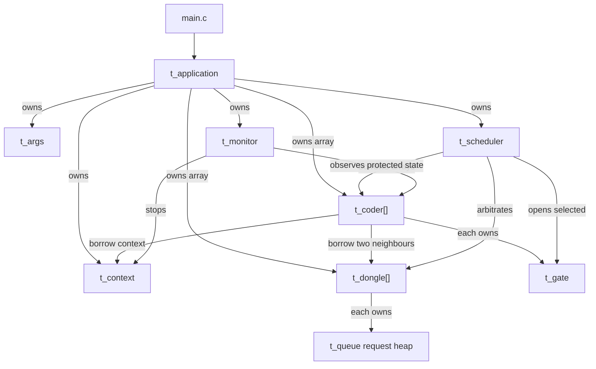
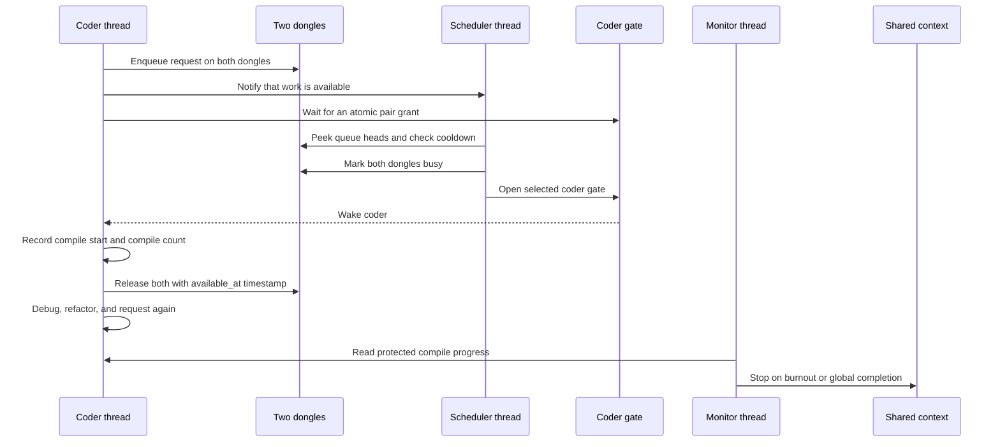

*This project has been created as part of the 42 curriculum by vlnikola.*

# Codexion

Codexion is a concurrency simulation inspired by the Dining Philosophers
problem. Coders sit around a shared workspace and repeatedly compile, debug,
and refactor. A coder needs both adjacent USB dongles at the same time to
compile, but every dongle is shared with a neighbour and remains unavailable
for a cooldown period after use.

The goal is to coordinate the coder threads without data races, deadlocks, or
unfair resource access. A dedicated scheduler grants dongles using either FIFO
(first request first) or EDF (earliest burnout deadline first). A separate
monitor stops the simulation when a coder burns out or when every coder reaches
the required number of compiles.

## Table of Contents

- [Development History](#development-history)
- [Current Status](#current-status)
- [Codebase Structure](#codebase-structure)
- [Architecture and Wiring](#architecture-and-wiring)
- [Runtime Flow](#runtime-flow)
- [Application Lifecycle](#application-lifecycle)
- [Blocking Cases Handled](#blocking-cases-handled)
- [Thread Synchronization Mechanisms](#thread-synchronization-mechanisms)
- [Instructions](#instructions)
- [Resources](#resources)
- [AI Usage Disclosure](#ai-usage-disclosure)

## Development History

I developed the project incrementally so that ownership and cleanup were clear
before starting the thread routines:

1. I implemented the argument parser and validation for all mandatory values,
   including the `fifo` and `edf` scheduler modes.
2. I introduced `t_application` as the composition root. It owns every
   allocation and initialized synchronization object, which gives the program
   one place for failure rollback and final cleanup.
3. I separated data definitions into `include/structs/`, public module
   interfaces into `include/modules/`, and implementations into matching
   folders under `src/`.
4. I implemented the custom binary heap used by dongle request queues. FIFO
   compares arrival sequence; EDF compares burnout deadline and then uses
   deterministic tie-breakers.
5. I added the shared context, protected running state, time helpers, and
   condition-variable-based coder gates.
6. I implemented initialization and partial-failure cleanup for dongles,
   coders, the scheduler, and the monitor.
7. I wired application initialization in dependency order and cleanup in
   reverse order. This has been checked with a complete build and Valgrind.

The next stage is the concurrency behaviour: dongle requests and releases,
scheduler arbitration, coder routines, monitor logic, serialized logging, and
thread startup and shutdown.

## Current Status

Completed infrastructure:

- argument parsing and scheduler-mode validation;
- application ownership model and module interfaces;
- FIFO/EDF request heap;
- shared context, running-state access, time helpers, and coder gates;
- dongle, coder, scheduler, and monitor initialization;
- reverse-order application cleanup and initialization rollback.

Still to implement:

- thread creation, coordinated start, waking, and joining;
- thread-safe dongle request and release operations;
- atomic two-dongle scheduling and cooldown enforcement;
- coder compile/debug/refactor routine;
- burnout and completion monitoring;
- serialized state logging.

## Codebase Structure

```text
.
├── Makefile
├── README.md
├── include
│   ├── structs              Data and ownership definitions only
│   │   ├── application.h
│   │   ├── args.h
│   │   ├── coder.h
│   │   ├── context.h
│   │   ├── dongle.h
│   │   ├── gate.h
│   │   ├── monitor.h
│   │   ├── queue.h
│   │   ├── request.h
│   │   └── scheduler.h
│   └── modules              Behaviour interfaces used by callers
│       ├── application_api.h
│       ├── coder_api.h
│       ├── context_api.h
│       ├── dongle_api.h
│       ├── gate_api.h
│       ├── logger_api.h
│       ├── monitor_api.h
│       ├── parser_api.h
│       ├── queue_api.h
│       ├── scheduler_api.h
│       └── time_api.h
└── src
    ├── application          Composition, startup, shutdown, and cleanup
    ├── coder                Per-coder state and thread routine
    ├── context              Shared simulation state
    ├── dongle               Dongle state, requests, and cooldown
    ├── gate                 Per-coder condition-variable event
    ├── monitor              Burnout and completion detection
    ├── parser               Argument parsing and validation
    ├── queue                Private FIFO/EDF binary heap
    ├── scheduler            Arbitration and atomic pair grants
    ├── utils                Time and serialized logging helpers
    └── main.c               Application entry point
```

Headers are not compiled or added to `SRC` in the Makefile. Source files
include the headers they need. The private `src/queue/queue_internal.h` header
belongs to the queue implementation and is not exposed as a public interface.

Type and naming conventions:

- `bool` stores predicates and initialization flags;
- `size_t` stores array sizes, capacities, and zero-based array positions;
- `int` stores parsed values, compile counts, and externally displayed coder
  IDs;
- `index` consistently names an array position, while `coder_id` names the
  one-based value printed in logs;
- `const` is used for borrowed input that a function only reads, but not for an
  object whose mutex must be locked or whose state may change.

## Architecture and Wiring

`t_application` is the only object that sees and owns the complete program.
Lower modules receive only the references required for their work. In
particular, coders cannot inspect other coders, and dongles do not hold coder
pointers.



Important access rules:

- A coder knows its own state, its left and right dongles, its gate, and the
  shared context. It has no pointer to the coder array.
- A dongle owns its availability state, mutex, and request heap. It does not
  know which coder objects exist.
- A request stores a coder ID, deadline, and arrival sequence rather than a
  coder pointer.
- The scheduler is the only runtime module allowed to inspect all coders and
  dongles when deciding a grant.
- The monitor reads coder progress through the coder data interface and stops
  the simulation through the context interface.

## Runtime Flow

The following sequence describes the intended runtime behaviour. The thread
routines and arbitration stage are still in progress.



For EDF, a request deadline is:

```text
last_compile_start + time_to_burnout
```

For FIFO, arrival sequence decides priority. Equal-priority requests use stable
tie-breakers so the same input produces the same ordering.

## Application Lifecycle

Initialization follows dependency order:

```text
parse arguments
    -> initialize context
    -> allocate and initialize dongles and queues
    -> allocate and initialize coders and gates
    -> initialize scheduler
    -> initialize monitor
```

Each module cleans its own partially initialized object. If a later stage
fails, `init_application()` calls `free_application()`, which destroys only the
resources recorded as successfully initialized.

The intended runtime lifecycle is:

```text
initialize
    -> set one shared start time
    -> create coder, scheduler, and monitor threads
    -> run until burnout, completion, or startup failure
    -> mark the context as stopped
    -> broadcast or open every blocking wait point
    -> join every successfully created thread
    -> destroy synchronization objects and allocations
```

Final cleanup runs in reverse dependency order:

```text
scheduler -> coders -> dongles -> context
```

Threads must be stopped and joined before their mutexes and condition variables
are destroyed.

## Blocking Cases Handled

The infrastructure for these cases exists; the concurrency routines that
enforce them are still being implemented.

### Deadlock prevention

Coders will request two dongles as one logical operation instead of taking one
and waiting while holding it. The scheduler will lock dongles in stable ID
order and grant both together. This removes the hold-and-wait condition and
prevents circular lock acquisition.

### Starvation prevention

Every dongle uses a heap ordered by the selected policy. FIFO preserves arrival
order. EDF prioritizes the coder with the earliest burnout deadline. Arrival
sequence and coder ID provide deterministic tie-breakers. A grant is valid only
when the coder is eligible at the head of both required dongle queues.

### Dongle cooldown

A released dongle records `available_at = release_time + dongle_cooldown`. The
scheduler must not grant it before that timestamp, even if its request queue is
not empty. Threads should wait until the next useful event instead of holding a
mutex while sleeping.

### Precise burnout detection

The monitor runs independently from coder threads. It reads each coder's
`last_compile_start` under the coder data mutex and compares the deadline with
the current time. It must wake frequently enough to report burnout no more than
10 ms late.

### Log serialization

All state messages pass through one logger protected by `context->log_mutex`.
This prevents output from different threads from interleaving. After the
context is stopped, normal state messages must be suppressed so nothing is
printed after the burnout message.

### Safe shutdown

Stopping changes `context->is_running` under `state_mutex`. Shutdown must then
wake the scheduler and all coder gates before joining threads; otherwise a
thread could remain blocked forever. Cleanup occurs only after every created
thread has been joined.

### One-coder case

With one coder, the left and right pointers refer to the same single dongle.
The coder cannot obtain two distinct dongles and must eventually burn out. The
implementation must not lock or release that same mutex twice.

## Thread Synchronization Mechanisms

- `context->state_mutex` protects the global running flag.
- `context->log_mutex` serializes output.
- Each `coder->data_mutex` protects its last compile time and compile count.
- Each `dongle->mutex` protects its busy state, cooldown timestamp, and request
  queue.
- `scheduler->condition` lets the scheduler sleep until a request, release,
  shutdown, or relevant timing event occurs.
- Each coder gate combines a mutex, condition variable, and `ready` predicate.
  The predicate is checked in a `while` loop because condition variables may
  wake spuriously.
- When two dongles must be inspected together, they are locked in increasing
  dongle ID order and unlocked in reverse order.
- No thread sleeps for compile, debug, refactor, or cooldown time while holding
  a shared-state mutex.

`pthread_cond_wait()` atomically releases its mutex while the thread sleeps and
reacquires it before returning. Setting predicates while holding the same mutex
prevents lost wakeups between the check and the wait.

## Instructions

Compile the program with:

```sh
make
```

Run it with all mandatory arguments:

```text
./codexion number_of_coders time_to_burnout time_to_compile \
    time_to_debug time_to_refactor number_of_compiles_required \
    dongle_cooldown scheduler
```

All time values are milliseconds. `scheduler` must be exactly `fifo` or `edf`.

Example:

```sh
./codexion 5 800 200 200 200 7 50 edf
```

Available Makefile targets:

```sh
make
make clean
make fclean
make re
```

## Resources

- [The Dining Philosophers Problem by DeRuina](https://github.com/DeRuina/philosophers)
- [The Dining Philosophers by Oceano](https://www.youtube.com/watch?v=zOpzGHwJ3MU&t=14s)
- [POSIX Threads Programming](https://www.geeksforgeeks.org/c/thread-functions-in-c-c/)
- [Coffman Conditions for Deadlock](https://en.wikipedia.org/wiki/Deadlock#Necessary_conditions)
- [Earliest Deadline First Scheduling](https://en.wikipedia.org/wiki/Earliest_deadline_first_scheduling)
- [Binary Heap](https://en.wikipedia.org/wiki/Binary_heap)
- [Binary Heap lecture, Charles University](https://ksvi.mff.cuni.cz/~dingle/2019/algs/lecture_10.html)

## AI Usage Disclosure

AI (ChatGPT Codex with GPT-5.6 Sol High reasoning model) was used as a design,
scaffolding, review, and documentation assistant. It helped explain the subject,
review the parser and initialization code, compare architectural approaches,
define ownership around `t_application`, create struct and module headers,
organize source skeletons, implement resource initialization and cleanup, and
standardize boolean, index, count, naming, and const conventions. It also
helped document the intended architecture and runtime wiring.

AI did not implement the concurrency simulation, scheduler routine, dongle
arbitration, monitor routine, logger, or coder routine. AI-assisted code and
documentation were reviewed and remain the responsibility of the project
author.
